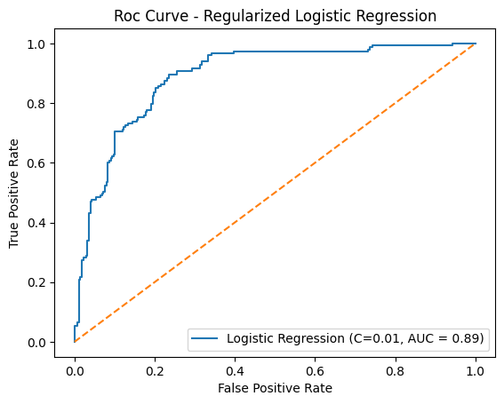
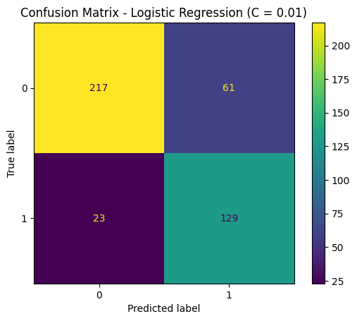

# Alzheimer’s Disease Prediction (Machine Learning Project)
# Overview

This project builds machine learning models to predict Alzheimer’s disease using demographic, lifestyle, and clinical data.

The goal is to evaluate how feature selection, model choice, and regularization impact predictive performance.

# Objectives
Predict Alzheimer’s diagnosis (0 = No, 1 = Yes)
Compare a baseline model (lifestyle features only) vs a full-feature model
Evaluate performance using:
Accuracy
Precision / Recall
ROC-AUC
📊 Dataset
Source: Kaggle Alzheimer’s Disease Dataset
Author: Rabie El Kharoua (2024)
Link: https://www.kaggle.com/dsv/8668279

Features include:
Demographic (age, gender)
Lifestyle (smoking, BMI, etc.)
Clinical and cognitive indicators

## This dataset is for educational purposes and not intended for clinical use.

# Models Used:
Logistic Regression (Final Model)
  - Feature scaling using StandardScaler
  - Regularization tuning (C values)
  - Interpretable coefficients
Random Forest
  - Captures non-linear relationships
  - Used for model comparison
# Methodology
# Data Exploration
  - Checked missing values, data types, and distributions
  - Identified class imbalance
  - Addressed using:
      - class_weight = 'balanced'
# Baseline Model (Lifestyle Features Only)
  - Limited predictive performance
  - Demonstrates lifestyle features alone are insufficient
# Full Feature Model
  - Included clinical + demographic + lifestyle features
  - Significant improvement in performance

# Regularization Tuning
Tested:
  - C = 1
  - C = 0.1
  - C = 0.01

Best performance achieved with:
  - C = 0.01
    - Reduced overfitting
    - Improved generalization
   
# Results (Final Model: Logistic Regression, C = 0.01)
Metric	Score
  - Accuracy	~0.82
  - Recall (Alzheimer’s)	~0.85
  - ROC-AUC	~0.86

# Model Performance
ROC Curve



The ROC curve shows strong class separability with an AUC of ~0.86.

Confusion Matrix



The model achieves high recall, reducing false negatives, which is critical in a medical context.

# Key Insights
  - Lifestyle features alone are not sufficient for prediction
  - Clinical and cognitive features significantly improve performance
  - Random Forest suggests non-linear relationships exist
  - Regularization improves generalization and reduces overfitting
  - Recall is prioritized to minimize false negatives

# Conclusion
A regularized Logistic Regression model (C = 0.01) was selected as the final model due to its strong performance and interpretability.

This project demonstrates:
  - Feature selection impact
  - Model comparison
  - Hyperparameter tuning
  -Evaluation of classification models

# Tech Stack
  - Python
  - Pandas
  - Scikit-learn
  - Matplotlib

# Project Structure
```
  alzheimers-ml-prediction/
  │
  ├── images/
  │ ├── roc_curve.png
  │ ├── confusion_matrix.png
  │
  ├── notebooks/
  ├── README.md
```
# Future Improvements
  - Add cross-validation
  - Include precision-recall curve
  - Try additional models (e.g., XGBoost)
  - Perform feature engineering

# Acknowledgements
This project uses the following dataset:
@misc{rabie_el_kharoua_2024,
title={Alzheimer's Disease Dataset},
url={https://www.kaggle.com/dsv/8668279}
,
DOI={10.34740/KAGGLE/DSV/8668279},
publisher={Kaggle},
author={Rabie El Kharoua},
year={2024}
}
